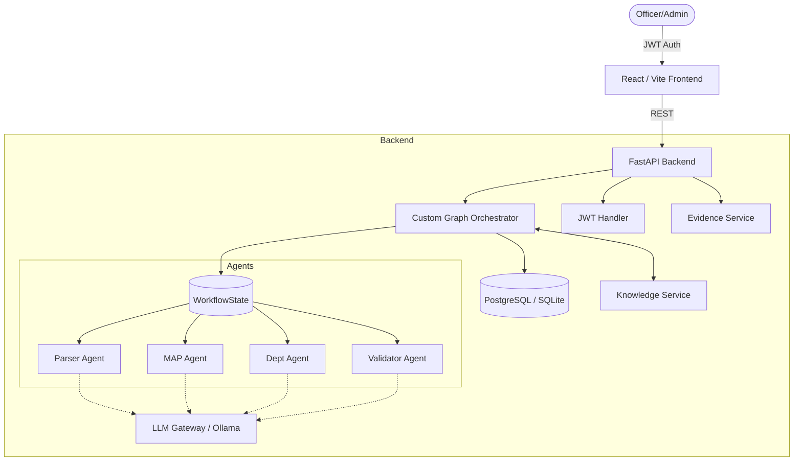
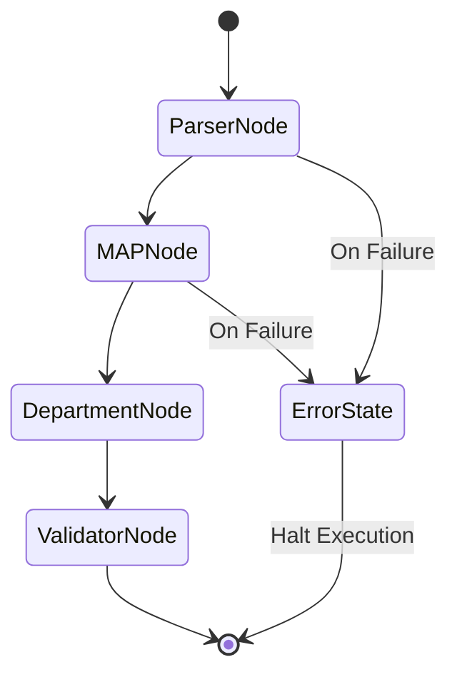

# 🛡️ RegIntel AI

**Agentic Regulatory Intelligence & Compliance Platform**

RegIntel AI is a production-grade, offline-capable AI compliance copilot. It completely automates the lifecycle of banking regulations—ingesting massive regulatory circulars, extracting measurable action points, validating evidence, and maintaining an unalterable audit trail using a custom Graph Orchestrator.

---

## 🌟 Key Features

* **Multi-Agent Architecture**: Dedicated specialized agents (Parser, MAP Generator, Department Assigner, Validator) executing tasks autonomously.
* **Custom Graph Orchestrator**: A lightweight, dependency-free LangGraph alternative managing state transitions, conditional routing, and error halting.
* **Agent Memory**: Semantic search integrations allowing agents to compare new regulations against historical contexts to prevent hallucinations.
* **Enterprise Security**: JWT-based Authentication and Role-Based Access Control (Admin vs. Officer views).
* **Next-Gen Frontend**: A highly appealing React/Vite dashboard featuring glassmorphism, Framer Motion animations, and interactive comet-tail cursors.
* **100% Offline Capable**: Powered by Ollama (`llama3.2`), ensuring zero data leakage for highly sensitive banking compliance data.

---

## 🏗️ Architecture

### High-Level System Architecture



### Low-Level Workflow State Transition



---

## 🚀 Deployment & Installation Guide

This project is built to industry standards and relies strictly on Environment Variables (`.env`) for configuration. **No secrets are hardcoded.**

### Step 1: Obtain Environment Secrets

Before running the app, you must create `.env` files in both the `backend/` and `frontend/` folders. You can copy the provided `.env.example` files.

#### Backend Secrets (`backend/.env`)
1. **`DATABASE_URL`**: 
   * *Local Test*: `sqlite:///./regintel.db` (Default)
   * *Production*: You need a PostgreSQL database. Obtain one for free from [Supabase](https://supabase.com) or [Neon](https://neon.tech).
2. **`SECRET_KEY`**: 
   * This is used for JWT token signing.
   * *How to generate*: Run this in your terminal: `openssl rand -hex 32` or use [GenerateRandom](https://generate-random.org/encryption-key-generator).

#### Frontend Secrets (`frontend/.env`)
1. **`VITE_API_URL`**: 
   * *Local Test*: `http://localhost:8000`
   * *Production*: The URL where your FastAPI backend is deployed (e.g., Render, Railway, AWS).

### Step 2: Running Locally (Manual Setup)

**1. Start the Backend (FastAPI)**
```bash
cd backend
python -m venv venv

# Windows
venv\Scripts\activate
# Mac/Linux
source venv/bin/activate

pip install -r requirements.txt
uvicorn main:app --reload --port 8000
```

**2. Start the Frontend (React/Vite)**
```bash
# In a new terminal window
cd frontend
npm install
npm run dev
```
Access the stunning UI at `http://localhost:5173`.

### Step 3: Running via Docker (Production Grade)

Ensure Docker is installed, then simply run:
```bash
docker-compose up --build
```
This single command spins up PostgreSQL, the FastAPI Backend, and the React Frontend seamlessly.

---

## 🛡️ Usage & Fallbacks

* **Demo Accounts**: Use `admin/admin123` for full access (including Audit logs), or `officer/officer123` for standard access.
* **LLM Fallback**: The `LLMGateway` is designed to gracefully fallback or halt execution if Ollama crashes, setting `status="error"` in the state graph.
