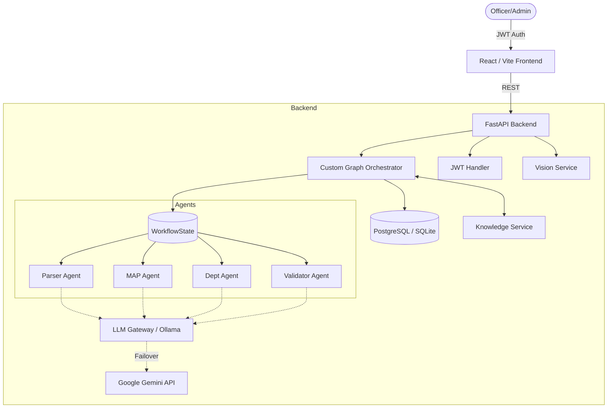
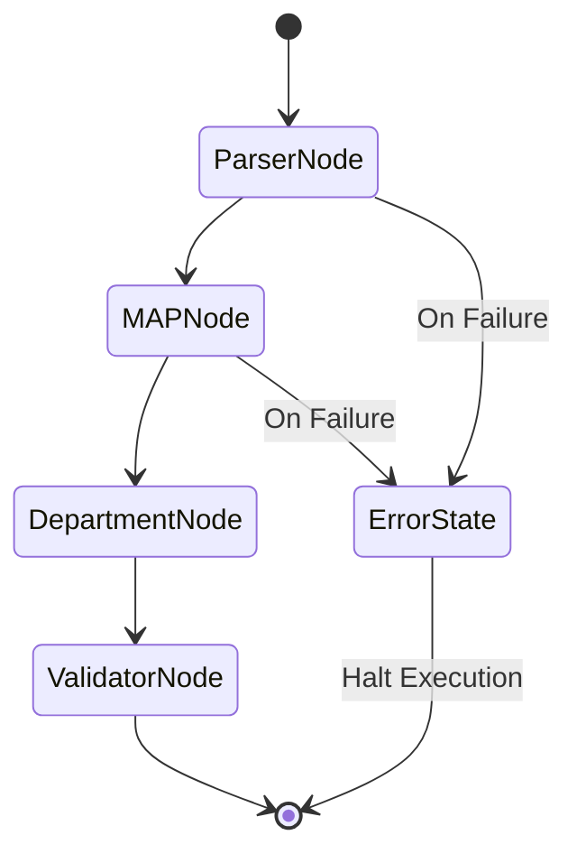

<div align="center">
  
  
  # 🛡️ RegIntel AI
  
  **Agentic Regulatory Intelligence & Compliance Platform**

  *Built by a First-Year B.Tech CSE Student @ Delhi Technological University (DTU)*

</div>

<p align="center">
  RegIntel AI is a production-grade, offline-capable AI compliance copilot. It completely automates the lifecycle of banking regulations—ingesting massive regulatory circulars, extracting measurable action points, validating evidence algorithmically via Vision models, and maintaining an unalterable audit trail using a custom Graph Orchestrator.
</p>

---

## 🌟 Architectural Marvels (Key Features)

* **Multi-Agent Architecture**: Dedicated specialized agents (Parser, MAP Generator, Department Assigner, Validator) executing tasks autonomously.
* **Custom Graph Orchestrator**: A lightweight, dependency-free LangGraph alternative managing state transitions, conditional routing, and error halting.
* **Dual-LLM Transparent Failover**: 100% Offline-First for enterprise security powered by Ollama (`llama3`). If local compute crashes during an intense workload, the API instantly tunnels requests to Gemini Cloud APIs, ensuring absolute 100% uptime for production/demos.
* **Dynamic Priority Engine**: Agents syntactically grade the severity of a regulatory impact (1-10). Critical cyber breaches automatically jump to the top of Department queues.
* **AI Vision Auditor**: Instead of humans verifying proof of compliance, officers upload photos. The platform utilizes LLaVA (Offline Vision) and Gemini Vision to algorithmically determine if the evidence matches the regulatory mandate.
* **Swiggy-Style UX Tracker**: The stunning React frontend directly subscribes to the Graph Engine's state, visually tracking a document's progression through nodes in real time.
* **Anti-Fraud Escalation Engine**: Restricts officers to 3 evidence upload attempts per regulation. After 6 total failures across the platform, the officer's account is permanently banned. Fraudulent uploads immediately alert the Admin dashboard.
* **Intelligent JSON Parsing & Novice Translation**: The backend natively strips hallucinated markdown, enforcing strict schema compliance, while the MAP Agent translates complex banking jargon into highly descriptive, novice-friendly AI summaries and separated step-by-step recommendations.
* **Dynamic MAP UI Engine**: The frontend intercepts raw JSON action plans from the LLM and mathematically splits them into beautiful Action, Metric, and Evidence UI Cards, ensuring absolute readability.
* **Advanced Compliance Reporting & Heatmaps**: Built-in Admin tools feature a live 2D Compliance Risk Heatmap to visualize departmental loads, dynamic department filtering, and one-click CSV Data Exports of the entire compliance queue.
* **Fault-Tolerant Database Integration**: Active connection probing that automatically falls back from Cloud PostgreSQL to Local SQLite during network outages.

---

## 🏗️ Architecture

### High-Level System Architecture



### Low-Level Workflow State Transition



---

## 🚀 Local AI Setup & Installation Guide

This project is built to industry standards and relies strictly on Environment Variables (`.env`) for configuration. **No secrets are hardcoded.**

### Step 1: Install Local AI (Offline Models)
RegIntel AI is heavily optimized to run on local hardware to prevent banking data leakage.
1. Download **Ollama**: [ollama.com/download](https://ollama.com/download)
2. Open your terminal and run:
   ```bash
   ollama run llama3
   ollama run llava
   ```
   *(Ensure the Ollama app remains open in your system tray so the backend can reach `http://localhost:11434`)*

### Step 2: Obtain Environment Secrets
You must configure the transparent failovers. 
1. Get a [Gemini API Key](https://aistudio.google.com/app/apikey).
2. Create `.env` files in `backend/` and `frontend/` by copying the `.env.example` files.
   * `backend/.env`: Set `GEMINI_API_KEY="your_key"`. Set `DATABASE_URL="sqlite:///./regintel.db"` (Or use a Postgres URL).
   * `frontend/.env`: Set `VITE_API_URL="http://localhost:8000"`

### Step 3: Running Locally (Manual Setup)

**1. Start the Backend (FastAPI)**
```bash
cd backend
python -m venv venv

# Windows
venv\Scripts\activate
# Mac/Linux
source venv/bin/activate

pip install -r requirements.txt
uvicorn main:app --reload --port 8000
```

**2. Start the Frontend (React/Vite)**
```bash
# In a new terminal window
cd frontend
npm install
npm run dev
```
Access the stunning UI at `http://localhost:5173`.

### Step 4: Running via Docker (Production Grade)
Ensure Docker is installed, then simply run:
```bash
docker-compose up --build
```

---

## 🛡️ Usage & Role-Based Access

* **Admin Role (Master Dashboard)**: Use `admin` / `admin123`. Grants access to the global Heatmaps, execution logs, and complete priority queues.
* **Officer Role (Department UI)**: Use `officer` / `officer123`. Grants access to department-specific queues and the Vision Auditor upload portal.
